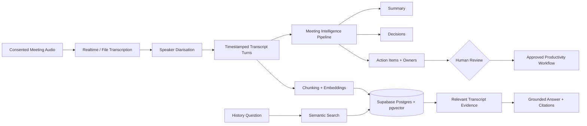
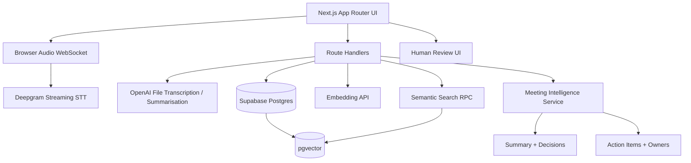
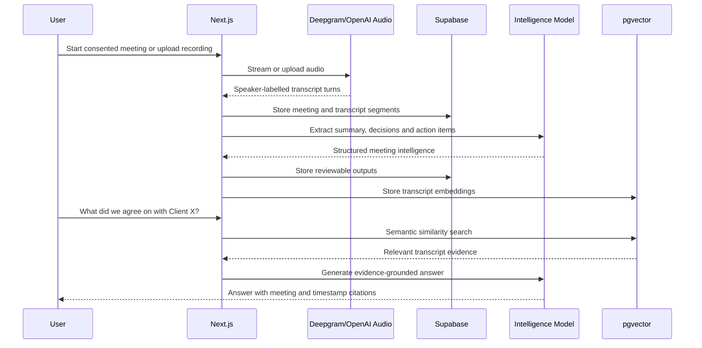

<div align="center">

# 🎙️ MeetMind AI Copilot

### Live Transcription, Speaker-Aware Meeting Intelligence, Action Items and Semantic Search

Turn consented meeting audio into speaker-labelled transcripts, concise summaries, owned action items, decisions, and searchable organisational memory.

**Next.js • Deepgram • OpenAI Audio • Supabase • PostgreSQL • pgvector • TypeScript**

> Privacy-first reference implementation. Record or transcribe meetings only with appropriate participant notice, consent, organisational policy, and applicable legal review.

</div>

---

## 🌟 Why MeetMind?

Meeting tools often stop at transcription. MeetMind converts approved meeting audio into structured, searchable work:

- Live or uploaded audio transcription
- Speaker diarisation and timestamped turns
- Meeting summaries
- Decisions and commitments
- Action items with owners and due dates
- Full-text and semantic meeting-history search
- Questions such as “What did we agree on with Client X?”
- Source-linked answers that point back to transcript segments
- Human review before action items are accepted

## 🎬 Product Flow



## 🏗️ Architecture



## 🔄 End-to-End Sequence



## ✨ Features

### Audio AI

- Browser microphone capture
- Deepgram-ready realtime WebSocket flow
- Uploaded audio transcription
- OpenAI transcription provider adapter
- Speaker-labelled transcript turn schema
- Start/end timestamps
- Interim and final transcript handling
- Provider-independent transcription interface

Deepgram diarisation assigns speaker labels to words and supports streaming diarisation through its current streaming diariser options. citeturn31search1turn31search3 OpenAI supports separate file and realtime transcription workflows, with specialised options for speaker-labelled file transcripts and live audio. citeturn31search7turn31search8

### Meeting Intelligence

- Executive summary
- Discussion themes
- Decisions
- Risks and blockers
- Action items
- Suggested owner
- Suggested due date
- Confidence and source segment IDs
- Human review status

### Searchable Meeting Memory

- Transcript chunks embedded into pgvector
- Semantic search by meaning
- Client and project metadata filters
- Meeting-date filters
- Source meeting IDs and timestamps
- Grounded answer generation
- Explicit “insufficient evidence” response

Supabase semantic search uses embeddings stored alongside Postgres records and similarity functions to retrieve conceptually relevant content, even when wording differs. citeturn31search13turn31search14

### Productivity Workflow

- Review action items before acceptance
- Reassign owners
- Edit due dates
- Mark items approved or rejected
- Export approved items
- Preserve source transcript references

## 🔐 Privacy and Responsible Use

- Explicit consent acknowledgement before recording
- No covert recording capability
- No automatic microphone start
- Audio upload size and MIME validation
- Secrets remain server-side
- Row Level Security migration templates
- Meeting ownership and organisation scopes
- Source-linked summaries and action items
- Human review before productivity actions
- Configurable retention design
- No emotion, personality, health, or protected-trait inference

Laws and workplace policies vary. Obtain appropriate participant notice and consent before recording or transcribing. Do not use the project for covert surveillance.

## 🛠️ Technology Stack

### Frontend

- Next.js App Router
- React
- TypeScript
- Tailwind CSS
- Browser MediaRecorder API

### Audio AI

- Deepgram streaming transcription
- OpenAI Audio transcription adapter
- Speaker diarisation
- Timestamped transcript turns

### Intelligence

- OpenAI Responses API-compatible summarisation
- Structured JSON outputs
- Evidence-grounded meeting Q&A

### Data and Search

- Supabase Auth-ready design
- Supabase Postgres
- pgvector
- HNSW vector index
- SQL RPC similarity search

### Delivery

- Docker
- GitHub Actions
- Vitest
- ESLint

## 📁 Project Structure

```text
meetmind-ai-copilot/
├── app/
│   ├── api/
│   │   ├── meetings/route.ts
│   │   ├── meetings/[id]/analyse/route.ts
│   │   ├── search/route.ts
│   │   └── transcribe/route.ts
│   ├── meetings/[id]/page.tsx
│   ├── search/page.tsx
│   ├── globals.css
│   ├── layout.tsx
│   └── page.tsx
├── components/
│   ├── action-items.tsx
│   ├── audio-recorder.tsx
│   ├── meeting-card.tsx
│   └── transcript-view.tsx
├── lib/
│   ├── deepgram.ts
│   ├── embeddings.ts
│   ├── intelligence.ts
│   ├── openai.ts
│   ├── search.ts
│   ├── supabase-admin.ts
│   └── types.ts
├── supabase/migrations/
│   └── 001_meetmind.sql
├── tests/
│   ├── chunking.test.ts
│   └── intelligence.test.ts
├── .env.example
├── Dockerfile
├── docker-compose.yml
├── package.json
└── README.md
```

## ⚡ Quick Start

### Prerequisites

- Node.js 20+
- npm
- Supabase project
- OpenAI API key for summaries, embeddings, and optional file transcription
- Deepgram API key for realtime transcription

### 1. Clone

```bash
git clone https://github.com/sgt-9304/MeetMind-AI-Copilot.git
cd MeetMind-AI-Copilot
```

### 2. Install

```bash
npm install
```

### 3. Configure

```bash
cp .env.example .env.local
```

Windows:

```powershell
copy .env.example .env.local
```

Fill only your local `.env.local`. Never commit it.

### 4. Apply the database migration

Open Supabase SQL Editor and run:

```text
supabase/migrations/001_meetmind.sql
```

### 5. Start

```bash
npm run dev
```

Open `http://localhost:3000`.

## 🔧 Environment Variables

```env
NEXT_PUBLIC_SUPABASE_URL=
NEXT_PUBLIC_SUPABASE_ANON_KEY=
SUPABASE_SERVICE_ROLE_KEY=
OPENAI_API_KEY=
DEEPGRAM_API_KEY=
OPENAI_TRANSCRIPTION_MODEL=gpt-4o-transcribe-diarize
OPENAI_SUMMARY_MODEL=gpt-4.1-mini
OPENAI_EMBEDDING_MODEL=text-embedding-3-small
DEEPGRAM_MODEL=nova-3
DEEPGRAM_DIARIZE_MODEL=latest
MAX_AUDIO_MB=25
```

## 🗄️ Data Model

### meetings

Stores title, client, project, start time, consent status and meeting metadata.

### transcript_segments

Stores speaker, timestamps, text, source meeting and embedding vector.

### meeting_insights

Stores summary, decisions, risks and analysis status.

### action_items

Stores task, suggested owner, due date, source segment and human-review state.

## 🔌 API Routes

### Create meeting

```http
POST /api/meetings
```

```json
{
  "title": "Client X Weekly Review",
  "client": "Client X",
  "project": "Data Platform",
  "consentConfirmed": true
}
```

### Transcribe recording

```http
POST /api/transcribe
Content-Type: multipart/form-data
```

### Analyse meeting

```http
POST /api/meetings/{meeting_id}/analyse
```

### Search history

```http
POST /api/search
```

```json
{
  "question": "What did we agree on with Client X?",
  "client": "Client X",
  "limit": 8
}
```

## 🧠 Structured Intelligence Output

```json
{
  "summary": "Concise meeting summary",
  "decisions": [
    {
      "text": "Proceed with the staged migration",
      "sourceSegmentIds": ["segment-id"]
    }
  ],
  "actionItems": [
    {
      "task": "Share the migration checklist",
      "owner": "Speaker 1",
      "dueDate": null,
      "sourceSegmentIds": ["segment-id"],
      "reviewStatus": "pending"
    }
  ],
  "risks": []
}
```

## 🔎 Semantic Meeting Search

```text
Question
   ↓
OpenAI query embedding
   ↓
Supabase RPC
   ↓
pgvector cosine similarity
   ↓
Client/date-filtered transcript evidence
   ↓
Grounded answer with meeting and timestamp citations
```

Supabase documents HNSW-backed pgvector search and SQL RPC functions as a standard semantic-search pattern. citeturn31search13turn31search14

## 🎙️ Transcription Modes

### Realtime Deepgram

Best for live captions and speaker-aware streaming. The project exposes a server-side token/config endpoint pattern so the provider key is never sent directly in source code.

### Uploaded Audio

Best for completed recordings. The project supports an OpenAI transcription adapter and leaves provider selection configurable. OpenAI recommends choosing file transcription for bounded recordings and realtime transcription when audio arrives live. citeturn31search7turn31search8

## ✅ Testing

```bash
npm run lint
npm run test
npm run build
```

Tests cover transcript chunking and structured action-item validation.

## 🐳 Docker

```bash
docker compose up --build
```

Open `http://localhost:3000`.

## 🚧 Known Limitations

- Provider credentials are required for real transcription and LLM analysis
- Live audio capture varies by browser and meeting platform
- Speaker labels such as Speaker 0 do not automatically identify real names
- Overlapping speech and poor microphones can reduce transcription quality
- Action-item owners are suggestions until reviewed
- Meeting search quality depends on transcript and embedding quality
- The starter does not directly join Zoom, Teams, or Meet calls
- No calendar integration is included yet
- No enterprise SSO is included yet

## 🗺️ Roadmap

- [ ] Durable realtime WebSocket relay
- [ ] Speaker-name mapping UI
- [ ] Calendar integrations
- [ ] Microsoft Teams and Zoom import connectors
- [ ] Hybrid full-text plus vector search
- [ ] Action-item export to Jira, Planner and Linear
- [ ] Organisation RBAC and enterprise SSO
- [ ] Retention controls and deletion workflows
- [ ] OpenTelemetry traces and cost dashboards
- [ ] Multilingual meeting support
- [ ] Evaluation dataset for diarisation, retrieval and action items

## 🤝 Suggested Contributions

- `good first issue`: Add transcript export to Markdown
- `good first issue`: Add meeting date filters
- `frontend`: Add speaker-name mapping
- `search`: Add hybrid search
- `integration`: Add Jira export
- `audio`: Improve live waveform visualisation
- `evaluation`: Add action-item precision metrics
- `security`: Add organisation RBAC

Do not submit real private meeting recordings, customer information, credentials, or employer/client transcripts.

## 📊 Evaluation Plan

Measure the system using:

- Word error rate
- Diarisation error rate
- Speaker-turn alignment
- Action-item precision and recall
- Owner-attribution accuracy
- Decision-extraction accuracy
- Retrieval Recall@k and MRR
- Citation correctness
- Summary faithfulness
- End-to-end latency
- Cost per meeting hour

Do not publish invented accuracy scores. Test with representative, consented or synthetic audio and report actual measured results.

## 📄 License

MIT for the reference code. Provider APIs and SDKs remain subject to their own terms.

<div align="center">

### From conversation to accountable work

**Transcribe • Understand • Search • Review • Act**

⭐ Star the repository if the audio-AI and productivity architecture is useful.

</div>
